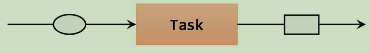
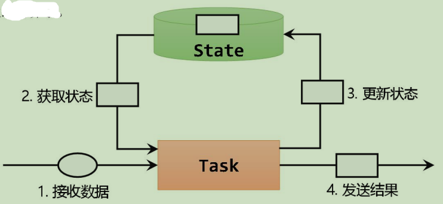
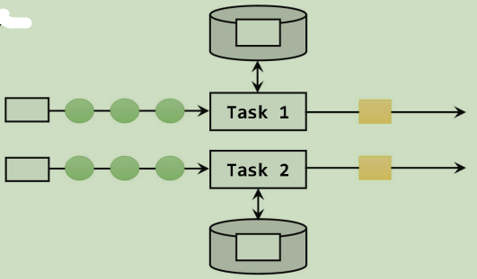
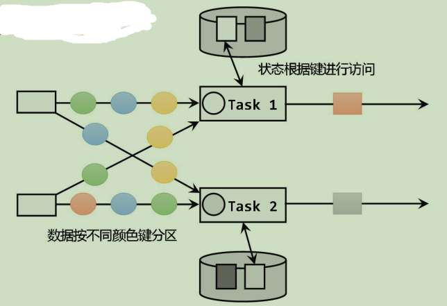

#  概述
flink是有状态的计算，其内部也有状态机制，flink中的算子任务可以分为无状态和有状态两种情况。
1. 无状态就是根据当前输入的数据直接计算为输出结果，只需要关注每个独立计算事件就可以了，计算时不依赖其他数据，如map、filter、flatmap等。

2. 有状态计算就是在计算过程中，除了当前输入数据之外，还需要与一些`状态state`数据（其他数据）共同得到计算结果，例如聚合算子、窗口算子d等。但是，状态和普通的临时存储不同的是，状态在flink中是一个由保障的长期备份，不会因为一些意外情况就消失或者变化。

# 分类
状态分为`托管状态`和`原始状态`，托管状态是指将状态交给flink进行托管，原始状态是指自定义状态管理，大多都是交给flink进行托管。托管状态中将状态分为`算子状态（operator state）`和`按键分区状态（键控状态 keyed state）`，经过keyby之后的算子就是键控状态，不然就是算子状态。
```java
// 注：不同的计算任务会占据不同的任务槽（task slot），不同的槽的计算资源是物理隔离的，不存在共享的问题，无法共享，这里的状态管理分类是以并行子任务为前提的
```
## 算子状态
状态对于算子当前的并行子任务是共享的，每个并行子任务都能访问到相同的状态，并且只能有一个状态。

## 键控状态
按键分区状态可以隔离不同分区（或者说主键）工作流中各自的状态，工作流无法访问其他分区的状态，可以有多个状态，实践中运用较多，下面详细说一下键控状态。

# 键控状态 keyed state
可以通过`富函数类（rich function）`来定义keyed state，所有，即使是map、filter这样的无状态的基本转换算子，都是能够通过富函数类定义键控状态，例如：RichMapFunction、RichFilterFunction等，都可以调用getRuntimeContext()方法获取上下文（RuntimeContext），进而获取到访问状态的句柄。从这角度说，flink中所有算子都是有状态的。

状态在使用之前要先声明和初始化。
1. 在`KeyProcessFunction`函数中进行定义：
```java
xxxState<T> xxxState;
```
2. 状态不能在声明时定义，一定要使用`KeyProcessFunction`函数中的`open()`方法进行定义（idea中可以使用`Ctrl+O`快捷键来填充允许重写的方法）：
```java
public void open(Configuration parameters) throws Exception {  
    super.open(parameters);  
    // 初始化值状态 lastVCState  
    xxxState = getRuntimeContext().getXxxState(
	    /**  
		 * T: 状态的类型  
		 * name: 唯一的值状态描述器的命名  
		 * typeInfo: 状态的类型信息，要使用flink包中的Types类  
		 */
	    new XxxStateDescriptor<T>("name", typeInfo) //描述器
	);  
}
```

以下方法的处理对象都是本组的数据，键控状态都是要先分组的。

键控状态还分为以下六类。
## 值状态 ValueState
状态中存储的仅仅只有一个值，使用的是ValueState<\T>这个接口，值状态的核心方法：
```java
lastVcState.value(); // 取出 本组值状态 的数据
lastVcState.update(); // 更新 本组值状态 的数据
lastVcState.clear(); // 清除 本组值状态 的数据
```
## 列表状态 ListState
将需要保存的数据以列表的形式存储起来，使用`ListState<\T>`接口，使用方法类似于值状态，其也有描述器：`ListStateDescriptor`，用法和`ValueStateDescriptor`完全一致。常用的方法有：
```java
Iterable<T> get(); // 获取当前的列表状态
update(List<T> values); // 传入一个列表 values
add(T value); // 在状态列表中添加一个元素 value
addAll(List<T> values); //向列表中添加多个元素，以列表形式传入
clear(); //清空list状态
```
## 映射状态 MapState
将一些键值对作为整体状态保存起来，是一组k-v映射列表，使用`MapState<UK,UV>`，其中UK、UV是两个泛型，表示的是k、v的类型，使用方法类似于Map，常用的方法有：
```java
UV get(UK key); //得到k对应的value值
put(UK key, UV value); //传入一个键值对，更新key对应的value值，若是key不存在则创建
putAll(Map<UK, UV> map); //将传入的map参数中的键值对全部更新为映射状态
remove(UK key); //删除key对应的键值对
boolean contains(UK key); //判断状态中是否包含key对应的键值对
Iterable<Map.Entry<UK, UV>> entries(); //获取映射状态中的所有键值对，返回的是一个可迭代对象，可以直接使用for循环进行遍历
Iterable<Map.Entry<UK, UV>> iterator(); //获取映射状态中的所有键值对，返回的是一个迭代器，无法直接使用for循环进行遍历，可以用while进行遍历
Iterable<UK> keys(); //获取映射状态中所有的key
Iterable<UK> values(); //获取映射状态中所有的value
boolean isEmpty(); //判断映射状态是否为空
clear(); //清空状态
```
## 规约状态 ReducingState
保存添加进来的数据的规约值作为状态，只存储一个规约值。常用的场景是简单值运算，例如求和、求积等。常用的方法有：
```java
add(); //追加状态数据
get(); //获取状态值
clear(); //清空状态
```
## 聚合状态 AggregateState
保存添加进来的数据的聚合值作为状态，只存储一个聚合值。与规约状态类似，都是对状态的计算，最主要的区别是聚合状态的计算是由描述器中传入的一般化聚合函数来定义的，这就会比规约状态的计算更加灵活，可以实现求平均值、方差等。常用的方法有：
```java
add(); //追加数据
get(); //获取状态值
clear(); //清空状态
```
聚合状态的初始化和之前的状态有区别，需要指定计算过程：
```java
public void open(Configuration parameters) throws Exception {  
    super.open(parameters);  
    aggState=getRuntimeContext().getAggregatingState(  
            new AggregatingStateDescriptor<Integer, Tuple2<Integer,Integer>, Double>(  
                    "AggState",  //状态名称
                    /*
                    泛型<T>：IN：输入类型
			                ACC：中间计算类型
			                OUT：输出类型
                    */
                    new AggregateFunction<Integer, Tuple2<Integer, Integer>, Double>() {  
                        // 初始化中间计算过程对象 
                        public Tuple2<Integer, Integer> createAccumulator() {  
                            return Tuple2.of(0,0);  
                        }  
  
                        // 中间计算过程的累加逻辑（计算逻辑）
                        public Tuple2<Integer, Integer> add(Integer value, Tuple2<Integer, Integer> accumulator) {  
                            return Tuple2.of(accumulator.f0+value,accumulator.f1+1);  
                        }  
  
                        // 结果计算逻辑
                        public Double getResult(Tuple2<Integer, Integer> accumulator) {  
                            return accumulator.f0*1D/accumulator.f1;  
                        }  
  
                        // 一般用不上，会话模式用的比较多
                        public Tuple2<Integer, Integer> merge(Tuple2<Integer, Integer> a, Tuple2<Integer, Integer> b) {  
                            return null;  
                        }  
                    },  //状态聚合计算过程
                    Types.TUPLE(Types.INT,Types.INT)  //计算过程类型
            )  
    );  
}
```
# 状态生存时间 TTL
很多情况下，状态会随着时间的推移逐渐增长，会不断消耗存储空间，需要不断清理，clear()方法可以做到，若是在不能直接清除的情况下，就需要配置一个状态的“生存时间”（`time-to-live`，简称TTL），当状态在内存中的存在超过了这个时间，将会被清除。目前的TTL设置只支持处理时间。

这个过程是大部分情况下通过设置条件触发的，通过给状态附加一个属性“失效时间”（=当前时间+TTL），这样就可以判断是否失效，因为失效的状态并不需要立即删除，所以可以用这种方法更加方便。

配置状态的TTL需要创建一个`StateConfig`配置对象，然后调用状态描述器的`enableTimeToLive()`来启动，所以这个配置是在状态初始化（`open()`方法）中实现的。主要配置如下：
```java
// 配置TTl  
StateTtlConfig ttlConfig = StateTtlConfig
        //状态TTL配置的构造方法，必须调用，方法中传入Time，作为设定的状态生存时间。
        .newBuilder(Time.seconds(10)) 
        //设置更新策略，指定了什么时候更新状态失效时间。
        .setUpdateType(StateTtlConfig.UpdateType.XXX) 
        //设置状态的可见性，因为清除操作并不是实时的，所以当状态过期后可能还会继续存在。
        .setStateVisibility(StateTtlConfig.StateVisibility.YYY)  
        //得到一个状态生存时间配置（ttlConfig）。
        .build();
xxxStateDescriptor.enableTimeToLive(ttlConfig);
```
其中，更新策略主要有以下（代替上述代码中的`XXX`）：
```java
OnReadAndWrite //只有在读和写（更新）操作的时候更新失效时间
OnCreateAndWrite //只有在创建和写（更新）操作的时候更新失效时间
Disable //（不常用）不更新失效时间
```
状态可见性主要有以下（代替上述代码中的YYY）：
```java
NeverReturnExpired //默认行为：不返回过期状态
RetuenExpireDefNotCleanedUp //如果过期状态还存在，则返回
```
# 算子状态 Operator State
在算子并行实例上定义的状态，作用范围被限定为当前算子任务，使用较少，而且与key无关，只要数据被发送到一个同一个并行子任务上，就会起作用，一般用在**source与sink**等与外部系统连接的算子上。这里建议直接使用官方的连接器，这些连接器中都定义好了算子状态。